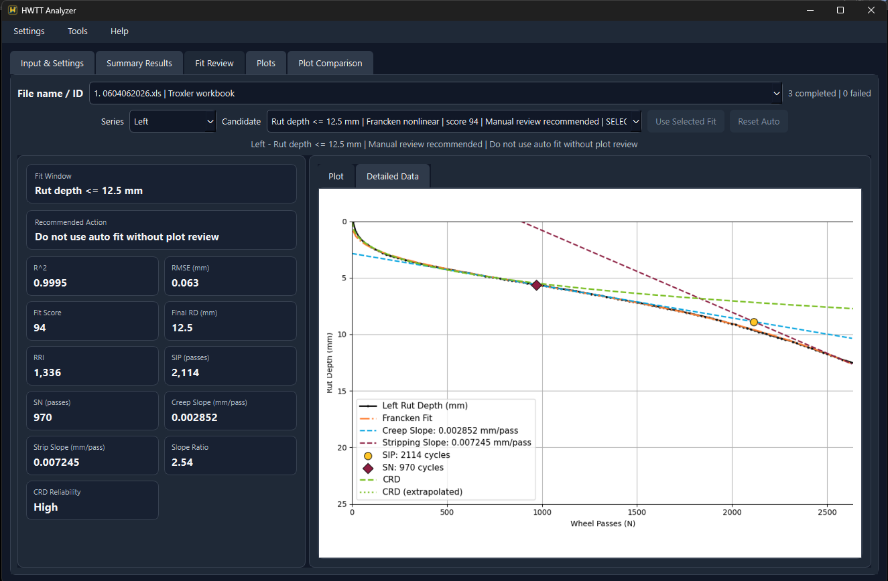
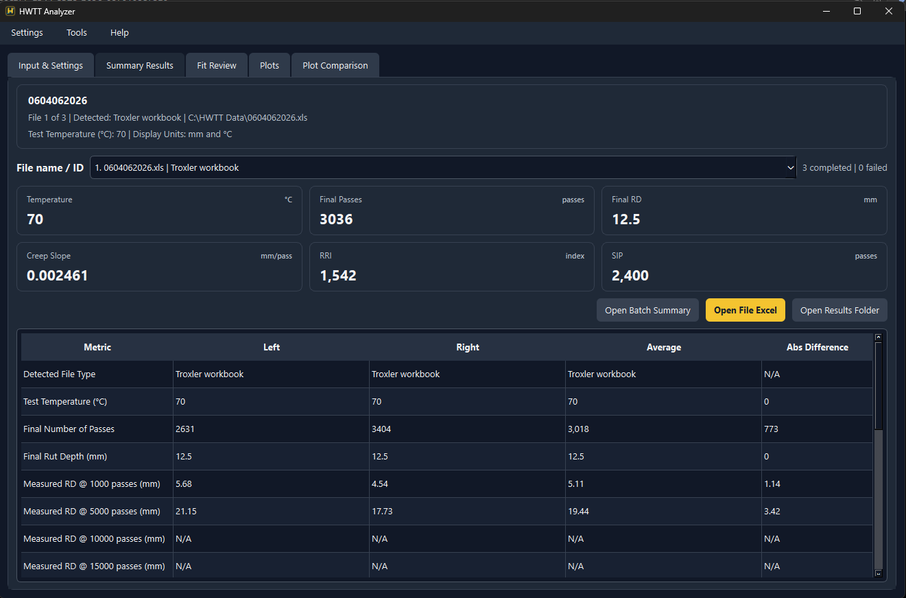
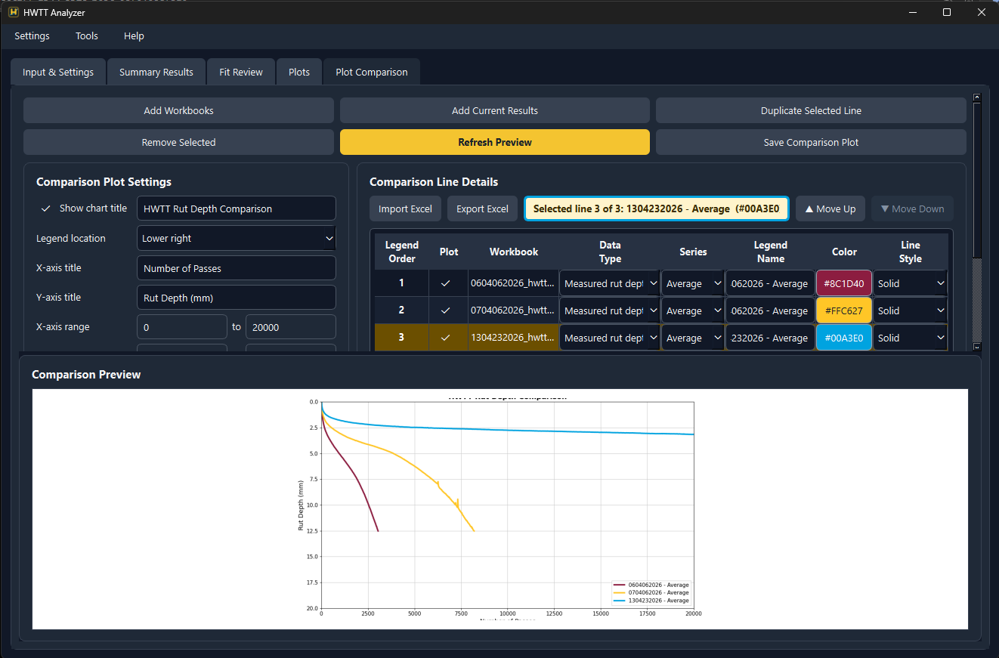

# HWTT Analyzer

**HWTT Analyzer** is a Windows desktop application for analysis, parameter extraction, visualization, and comparison of **Hamburg Wheel Tracking Test (HWTT)** data.

The application supports common HWTT equipment-output formats and a custom Excel input format. It provides rut-depth analysis, parameter extraction, model-fit review, plotting, Excel export, batch processing, and comparison of measured and modeled rut-depth curves across multiple tests.

## Download

**Current release:** [HWTT Analyzer v1.0.0](https://github.com/MWHasan/HWTTAnalyzer/releases/tag/v1.0.0)

**[Download the latest Windows release](https://github.com/MWHasan/HWTTAnalyzer/releases/latest)**

The application is distributed as a 64-bit Windows executable. No Python installation is required.

After downloading `HWTTAnalyzer-Windows-x64.zip`:

1. Extract the complete ZIP archive.
2. Keep `HWTTAnalyzer.exe` and the accompanying `_internal` directory together.
3. Run `HWTTAnalyzer.exe`.

> **Distribution:** The compiled Windows application is distributed through GitHub Releases. Source code is not included in this repository.

### Documentation

[**User Manual**](docs/HWTT_Analyzer_User_Manual.md) · [**Analysis Methodology**](docs/HWTT_Analyzer_Background_Data_Analysis_and_Modeling.docx) · [**Example Data**](examples/)

## What it does

HWTT Analyzer can:

- Import supported HWTT equipment-output files, including PTI, Troxler, Instrotech left/right pairs, and custom Excel input.
- Extract and summarize measured rut-depth data and derived analysis parameters.
- Analyze candidate fit windows and provide fit-review information.
- Generate plots and export analysis results to Excel workbooks.
- Work in Metric or U.S. customary display units while keeping calculations in canonical metric units.
- Process multiple cases from a folder using automatic source detection.
- Compare measured rut-depth curves and modeled creep rut-depth (CRD) curves from multiple analysis workbooks.
- Export comparison-line information for reuse.

## Application overview

HWTT Analyzer provides an integrated workflow for importing HWTT data, reviewing fitted models, extracting analysis parameters, generating analysis outputs, and comparing results across tests.

### Fit review and model evaluation

The Fit Review interface displays the measured rut-depth response together with the selected model fit and derived analysis parameters. Fit statistics and review recommendations are provided to support evaluation of the selected fit.

### Summary results

The Summary Results interface reports key HWTT parameters and tabulates results for the left, right, and average rut-depth series, together with the absolute difference where applicable.

### Plot comparison

The Plot Comparison interface allows results from multiple HWTT analysis workbooks to be displayed together. Users can select the data series, configure plot properties, reorder comparison lines, and export the resulting comparison plot.

## Getting started

### 1. Open HWTT Analyzer

After extracting the Windows release, run `HWTTAnalyzer.exe`.

### 2. Try an example dataset

Sample inputs are available in [`examples/`](examples/), including:

- PTI equipment output
- Troxler equipment output
- Instrotech left/right reports
- Custom Excel input

The example files are intended to demonstrate the supported import workflows and are sanitized sample data.

### 3. Run an analysis

1. Select the source type or use **Auto detect**.
2. Select the input file, or the matched Instrotech left/right pair.
3. Choose display units under **Settings > Units**.
4. Enter optional project information and test temperature.
5. Select the desired figure and Excel outputs.
6. Run **Analyze**.
7. Review the Summary, Fit Review, Plots, and exported Excel workbook.

For the complete workflow, see the [User Manual](docs/HWTT_Analyzer_User_Manual.md).

## Supported input examples

| Input type | Example |
|---|---|
| PTI | `examples/PTI_Equipment_Output_Example.xlsm` |
| Troxler | `examples/Troxler_Equipment_Output_Example.xls` |
| Instrotech | `examples/Instrotech_LEFT_Equipment_Output_Example.txt` + `Instrotech_RIGHT_Equipment_Output_Example.txt` |
| Custom Excel | `examples/Custom_Excel_Template.xlsx` |

## Output

Depending on the selected settings, HWTT Analyzer can produce:

- PNG figures
- Excel analysis workbooks
- Detailed fit information
- Measured and modeled rut-depth data
- Batch summaries for folder-based analysis
- Comparison plots in SVG, PNG, or PDF format

## Documentation

- [User Manual](docs/HWTT_Analyzer_User_Manual.md)
- [Analysis Background and Modeling](docs/HWTT_Analyzer_Background_Data_Analysis_and_Modeling.docx)
- [Examples](examples/)
- [User Agreement / EULA](docs/HWTT_Analyzer_EULA.txt)
- [Third-Party Notices](docs/THIRD_PARTY_NOTICES.txt)

## Important use note

HWTT Analyzer is an analysis aid. Users should independently review input data, fit selections, calculations, plots, exported workbooks, and reported parameters before using results for engineering decisions, acceptance, payment, publication, or other consequential purposes.

## Distribution and licensing

The executable distribution is **not an open-source software license**. The included EULA governs use of the application, and third-party components retain their respective licenses.

Before public distribution, confirm that ownership and release rights are consistent with any applicable university, employer, sponsor, project, funding, or research agreements.

## Support

The packaged application includes a Help menu with documentation and support information.

## Repository contents

This repository intentionally contains lightweight documentation, examples, and project materials. The packaged Windows executable and its bundled runtime are distributed through **GitHub Releases** rather than committed to the Git repository because GitHub blocks individual repository files larger than 100 MiB.

## Citation

If you use HWTT Analyzer in research, reports, or publications, please cite the software:

> Hasan, M. W. (2026). *HWTT Analyzer* (Version 1.0.0) [Computer software]. Zenodo. https://doi.org/10.5281/zenodo.21959248

**DOI:** [10.5281/zenodo.21959248](https://doi.org/10.5281/zenodo.21959248)

Citation metadata is also available in [`CITATION.cff`](CITATION.cff).
